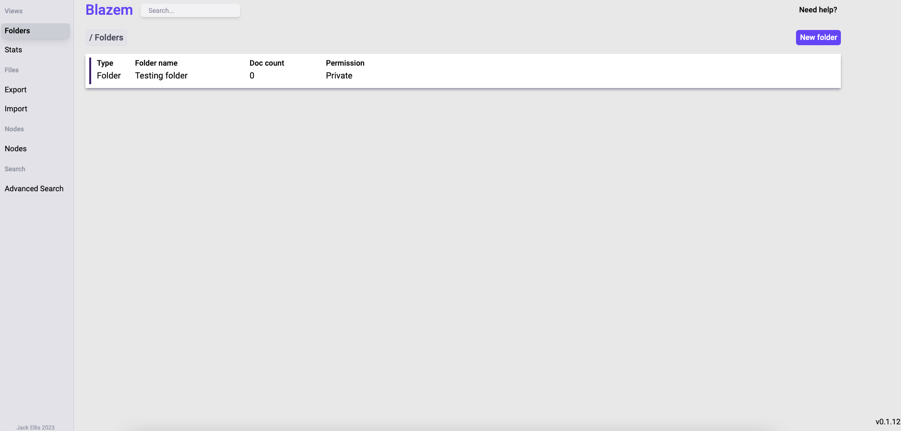

# Getting started with blazem



## Clone the repo

```
git clone git@github.com:jack-ellis123/blazem.git
```
### We use `Docker` for our builds.
## To run blazem for development run:
```
docker-compose dev up --build -d
```
(If an error occurs saying that the blazem_default network doesn't exist, just run the following:)

```
docker network create blazem_default
```

- This will create a blazem instance, you can access it on any browser at address `localhost:5173`
- Once you are at the login screen, use username `JackTest` and password `test123` to log in.
- From there, you should be able to see your root folders.

## Functionality that currently isn't implemented

- Global search (the search bar at the top of the screen)
- Stats
- Import and export of data
- Multi-node deployment (was removed to focus on core product)
- Proper privated folders for multiple users

## Make a change

Any improvements/bug fixes are welcome. 

## Once you finished your change

```
git checkout -b YOUR_AMAZING_FEATURE
git add .
git commit -m "COMMIT MESSAGE"
git push origin YOUR_AMAZING_FEATURE
```

Create your Pull Request and we'll get back to you.
